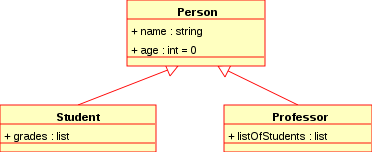

---
# Unified Modeling Language

Unified Modeling Language is a set of diagramming standards for drawing out how a software system should work.

It encompasses several different types of diagrams, but one in particular that you may see often is called a "Class Diagram".

Class diagrams define what custom object types a program has, what "public" properties and methods those object types have, and how the different object types relate to each other.

