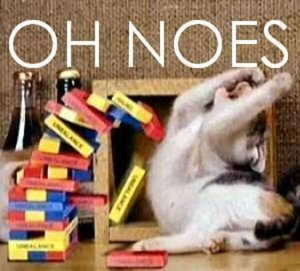

#Oh noes!

Not all browsers have the same DOM!

    

    

The situation is actually better than it used to be, but some browsers still have different ways of adding event listeners, changing the styles of elements, etc.

---
#jQuery

---
#jQuery

jQuery is a Javascript library that was written by John Resig. It provides an _abstraction layer_ around the DOM to make your live easier:

1. It smooths out the differences between browsers.
2. It simplifies finding DOM element objects to manipulate.
3. It simplifies working with AJAX (Web Dev 4).
4. It provides some basic animation funcionality.

...and much, much more!

---
#jQuery

We'll talk more about jQuery next week, but here's a sample.

    !javascript
    var el = jQuery('#test_paragraph');

    // el is now a jQuery object that *represents* 
    // the dom element of the paragraph above.

    el.css('color', '#ffffff');
    el.css('background', '#777777');
    el.css('padding', '40px');
    el.css('width', '500px');

---
#jQuery

  
A simple animation example.

    !javascript
    var el = jQuery('#move_me');

    var newStyles = {
        width: '300px',
        top: '50px',
        left: '300px'
    };

    el.animate( newStyles );

